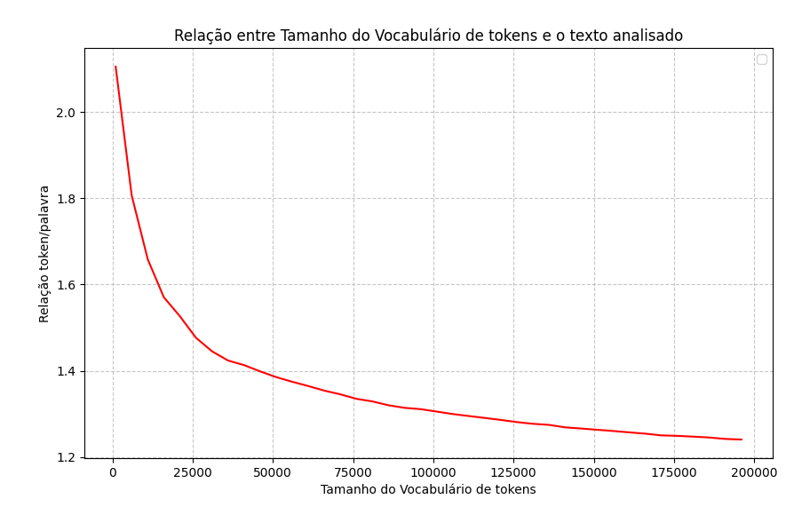

# Tokenização
Essa técnica surgiu a partir de uma necessidade básica: computadores não conseguem reconhecer palavras. Então para que possamos transmitir um texto para o computador compreender precisamos criar tokens numéricos, onde é possível aplicar cálculos matemáticos e inferir dados usando estatística ou álgebra linear.  
```
Texto = "Olá, mundo!"
Tokens = ["Olá", ",", "mundo", "!"]
Tokens = [15678, 11, 2345, 30]
```
Pontos importantes sobre a tokenização:  
- **Uma palavra** não necessáriamente vai gerar **um token**;  
- Palavras compostas ou muito grandes podem gerar mais de um token;  
- Existem tokens especiais de marcação para inferência, como a marcação de início e fim de texto, pedido do usuario, resposta do modelo entre outros.  
- O token gerado depende do contexto onde está a palavra e isso depende de muito treinamento.  
- Quando fornecemos **palavras desconhecidas** o tokenizador quebra a palavra em trechos com tokens conhecidos.  

## Técnicas de tokenização
### Tokenização por palavras (Word Based)
A forma mais intuitiva de tokenização, onde divide o texto por palavra e pontuação.  
- Não consegue lidar com palavras desconhecidas;  
- Pode ou não ignorar pontuação;  
```
"Eu amo inteligência artificial" -> ["Eu", "amo", "inteligência", "artificial", "!"]
```
### Tokenização por caracteres (Character-Based)
Divide o texto em caracteres individuais.  
- Usado apenas para gerar poucas centenas de tokens;  
- capaz de lidar com todas as palavras;  
- quanto maior o texto, mais difícil o processamento;  
```
"casa" -> ["c", "a", "s", "a"]
```
### Tokenização Morfológica  (Morphological)
Usa as regras linguísticas para dividir as palavras.
- Extremamente preciso
- Precisa de um conhecimento profundo do idioma
- Restrito a um idioma
- Difícil de generalizar para outros idiomas
```
"inesperadamente" → ["in", "esper", "ada", "mente"]
```

### Tokenização por Subpalavras (Subword Tokenization)
Busca o equilíbrio entre tokenização por palavra e por caractere. Possuem várias formas de aplicação:  
#### Character-Level Encoding 
- Converte os caracteres para unicode;  
- Começa separando caracteres individuais e vai mesclando os caracteres a medida que verifica a frequÊncia;
- Exige muito treinamento
- Consegue trabalhar com subpalavras e palavras desconhecidas
```
"baixo" (antes do treino ou palavra rara) -> ["b", "a", "i", "x", "o"]
"baixo" (após treino) -> ["baix", "o"] ou ["baixo"] se for uma palavra comum
```

#### WordPiece
Semelhante ao BPE mas usa análise estatística para gerar os tokens.  
- Usado por BERT, DistilBERT
- Usa o símbolo `##` para indicar continuação de palavra
```
"jogando" -> ["jog", "##ando"]
```
#### Byte-Level BPE
Semelhante ao Character-Level BPE, porém opera a nível de byte. 
- ***Usado pelos modelos de ML modernos: GPT, DeepSeek, LLaMA, RoBERTa***
- Palavras são separadas em bytes que a medida que ocorre o treinamento cria-se tokens mais representativos.
- Opera em cima do UTF-8 e permite trabalhar com qualquer idioma, inclusive com emoji;  
- capaz de tratar ruídos e erro de digitação.  
```
Frase: "Olá 😊"
Conversão para bytes (UTF-8):
    "O" → 0x4F (79)
    "l" → 0x6C (108)
    "á" → 0xC3 0xA1 (dois bytes: 195, 161)
    espaço → 0x20 (32)
    "😊" → 0xF0 0x9F 0x98 0x8A (quatro bytes: 240, 159, 152, 138)
Sequência de bytes: [79, 108, 195, 161, 32, 240, 159, 152, 138]
Depois do BPE: tokens como [79,108] ("Ol"), [195,161] ("á"), [240,159,152,138] ("😊"), etc.
```

## Implementação do Tokenizador BPE
Para implementar o Tokenizador BPE é um processo que não precisa de conexão com a internet. O objetivo é construir um vocabulário em forma de tokens e salvar para que possa processar qualquer texto de entrada. É importante dizer que o total de tokens determina diretamente a eficiência do BPE.
-Quanto maior o vocabulário de tokens:  
    - Mais palavras representadas;  
    - Processamento mais rápido (Tokens são mais precisos);  
    - Representa melhor idiomas extensos e ricos;  
    - **A etapa de embedding se torna mais pesada;**
    - **Mais memória necessária para processar o token, pois será preciso quebrar em blocos;** 
    - **Risco de treinamento excessivo (overfitting)** 
        - Overfitting é treinar além da curva ideal, o que permite memorizar padrões errados, ruído e dados irrelevantes.  
-Quanto menor o vocabulário:  
    - Mais compacto;  
    - Treinamento rápido;  
    - Maior número de tokens por palavra;  
    - Dificuldade em compreender palavras raras;  

### Pré-processamento
O BPE precisa de pouco pré processamento, pois analiza a nível de byte os textos. Mas dependendo do intuito pode ocorrer:
- Normalização para o formato unicode: Remover acentos e caracteres especiais
- Remoção de artefatos de código: Tags HTML, XML e afins;
    - Dependendo do interesse ou do objetivo pode manter as tags
- Não existe a necessidade de o espaço ou quebra de linha

### Conversão para Bytes
Todo o *corpus do texto* é convertido em formato UTF-8 que pode ser subdividido em bytes;
- *corpus do texto* - é o conjunto de vários textos
- O [UTF-8](https://pt.wikipedia.org/wiki/UTF-8) possui por padrão 4bytes por caractere
    - 1byte para ASCII
    - 2 bytes se for idioma latino, podendo chegar a 3bytes para alguns idiomas
    - 1byte para marcações  
- Em seguida é separado em lotes de 1 byte que podem assumir valor de 0 a 255;
```
Frase: "Olá 😊"
Conversão para bytes (UTF-8):
    "O" → 0x4F (79)
    "l" → 0x6C (108)
    "á" → 0xC3 0xA1 (dois bytes: 195, 161)
    espaço → 0x20 (32)
    "😊" → 0xF0 0x9F 0x98 0x8A (quatro bytes: 240, 159, 152, 138)
Sequência para o BPE: [79, 108, 195, 161, 32, 240, 159, 152, 138]
```
- Após criar a sequência de tokens percorre todo o corpus do texto e conta o número de repetiçoes de cada byte;
- Substitui os <ins>***2 blocos que se repetem juntos mais vezes***</ins> por um novo caractere e o adiciona no vocabulário;  
- O processo se repete continuamente até que o total de tokens atinja o tamanho esperado; 

### Critérios importantes para o BPA
#### Critério de parada
Um dos critérios mais importantes, pois o treinamento contínuo do BPE irá continuamente mesclar e reduzir o número de tokens continuamente, gerando um grande vocabulário pouco útil. Para isso limitamos o tamanho máximo do dicionário de tokens.
- Modelos de IA modernos usam  cerca de 100 a 128K tokens; 
    - DeepSeek: cerca de 128k com foco multilingual geral
    - GPT-3: cerca de 50k com foco em inglês
    - GPT-4: cerca de 100k com foco multilingual geral
    - LLaMA 2: cerca de 32k com foco em inglês
- Outro ponto importante é que o computador opera em base 2 então ter como limite um número em potência de 2 ajuda na indexação
- Limite de memória da GPU para processar os tokens, o idel é usar paralelismo em servidores ou limitar o número de lotes carregados na memória da GPU;  

### Principais métricas de vocabulário
#### Taxa de OOV (Out of Value)
Representa o número de palavras desconhecidas que não estão representadas no tokenizador
```
OOV = (número de palavras desconhecidas)/(total de tokens do tokenizador) * 100%
```
- O ideal é ser o menor possível se aproximando de 0

#### Cobertura de Caracteres Raros
- É a capacidade de representar caracteres raros ou símbolos que são poucos usados
- Evita que o modelo de IA apresente o símbolo �� para o usuário
- O ideal é que o corpus do texto usado para treinar o modelo do tokenizador apresente ***ao menos uma vez esses caracteres***
- Isso ocorre pois o tokenizador não consegue representar todas as possibiliades possíveis para 4 bytes.
    - 4 bytes permite representar ***cerca de 4.2 Bilhões de valores***
- O valor do CCR deve ser 0, ou seja representar todos os caracteres incomuns que existem para o idioma.

#### Tamanho do Vocabulário x Cobertura
Representa a relaçao entre o vocabulário e a cobertura, existe um limite para o quanto o aumento do vocabulário gera de ganho, gerando uma curva exponencial.  

  

*Obtido usando o treinamento do bpa desse repositório*

O ideal é a não passar do limite do "Joelho" da curva, poiso  ganho será muito pouco em relação ao tamanho.  

### Número de tokens por palavra
Representa a média de tokens gerados por palavra. É dado por:
```
taxa = (total de tokens)/(total de palavras)
```  
Os principais valores para esse parâmetro são:
    - valores próximo de 1 indica um vocabulário muito grande, podendo haver overfitting  
    - próximo de 2: O vocabulário é ineficiente, com muitas subpalavras  
    - **menor que 1,5: valor ideal**  
        - Estimasse que o total de tokens em portuguÊs usado nos modelos modernos esteja entre 1,2 e 1,5  

Para idiomas que não usam palavras separadas por espaço, pode usar ***Token por caractere***
```
taxa_caractere = (total de tokens)/(total de caracteres)
```

### Número de tokens únicos
- Contagem de tokens que aparecem uma vez ou nenhuma vez;  
- Para isso usamos um texto representativo ou vários textos representativos; 
- tokenizamos e contamos quantos tokens aparecem no corpus do texto e dividimos pelo total de tokens;  
- caso o valor seja muito alto há um superdimensionamento; 
    - Esperamos somente cerca de 95% de tokens sendo usados;

### Cobertura de n-grams
N-grams são termos prontos muito usados, como do, de, um, inho, ção, em um;
- um tokenizador pouco representativo pode representar n-grams fragmentados, como inho = [i, nho]
- ter uma alta cobertura de n-grams permite evitar a fragmentação aumentando a velocidade de processamento;
- para isso verifica o total de n-grams tokens únicos e o total de n-grams do idioma:
```
Cobertura = ((n-gram tokenizado)/(total de n-gram)) * 100
```
- o ideal é a cobertura ser de 100%

### Entropia da distribuição dos tokens
Mede a uniformidade de distribuição dos tokens.
- Se houver poucos tokens você irá usar com muita frequência, quase soletrando;  
- Enquanto um dicionário muito extenso há muitos tokens pouco usados, tornando ineficiente e grande;
- O ideal é ter poucas palavras muito repetidas, a maioria das palavras com uso médio e tokens de palavras grandes porém muito úteis; 
- essa distribuição se chama entropia:
    - é a soma da frequência de uso do token($p(token_i)$) multiplicado pelo logaritmo na base 2 de $p(token_i)$  

$$H = - \sum_{i} p(token_i) \log_2(p(token_i))$$

- Limites da entropia:
    - Uma entropia próximo de 1 significa que o sistema é ineficiente. Há poucos tokens usados muitas vezes e a maioria dos tokens são pouco usados;  
    - Uma entropia muito acima de 12 indica que os tokens são usados de forma homgênea, provavelmente são palavras muito grandes usadas poucas vezes de forma homgênea
    - Estima-se que a entropia ideal seja entre 7,5 e 10.
        - tem como base a Lei de Zipf, que descreve a distribuição de frequências em línguas naturais.
        - Os dados de entropia não são divulgados, mas rodando modelos antigos e abertos, se obtem uma entropia próxima de 10;  

### Estabilidade da segmentação
Verifica se a palavra está sendo quebrada no mesmo lugar, não importando onde apareça.
- Para isso criamos uma lista de segmentações possíveis para a mesma palavra; 
- Selecionamos a segmentação mais comum como a correta (moda); 
- atribuímos 1 sempre que ocorrer uma segmentação diferente da moda; 
- dividimos pelo total de ocorrências da palavra;
- A fórmula, de uma palavra $w$ que aparece ${N_w}$ vezes no corpus, a variância da segmentação é:  
$$Var = \frac{1}{N_w} \sum_{i=1}^{N_w} \mathbb{1}\left[ S_{w,i} \neq S_{w}^{\text{moda}} \right]$$
- Com isso calculamos a média ponderada:  
$$\text{Estabilidade Ponderada} = \frac{\sum_{w} N_w \times \text{Var}(w)}{\sum_{w} N_w}$$
- Ou a média normal
- O ideal é a Estabilidade ser o mais próximo de zero
### Reversibilidade
- É a capacidade dos tokens gerarem palavras
- Basta pegar um texto tokenizar gerando os tokens como resultado;  
- Em seguida passar os tokens pelo Tokenizador. Ele deve retornar o texto original; 
- O ideal é gerar o texto idêntico
### Robustez a ruído
É a capacidade de manter a integridade do texto, mesmo com erro de digitação.
- Para isso introduz um erro e verifica os tokens gerados
- Ex `A casa é bonita`trocando casa por caza:
    - A versão original gerou 4 tokens: `[A, casa, é, bonita]`;
    - O erro gerou 4 tokens: `[A, caza, é, bonita]`;
    - Foi alterado um token em 5 `1/4 = 25%`;
    - Agora se gerar 5 tokens `[A, ca, za, é, bonita]` 
        - Foi alterado 2 tokens logo `2/5 = 40%`;
- Esperamos uma alteração mínima de tokens.
